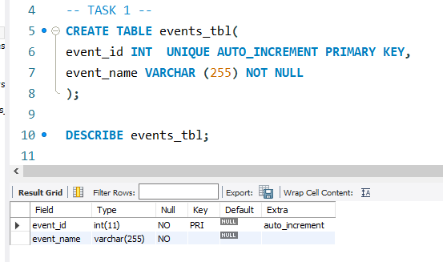
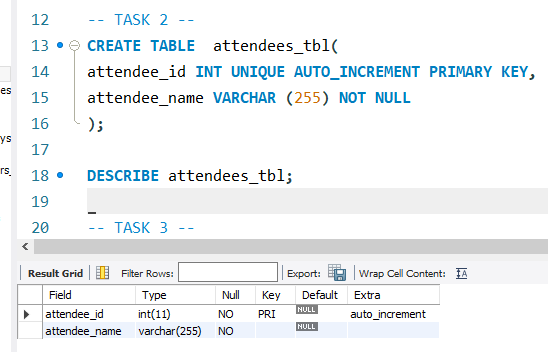
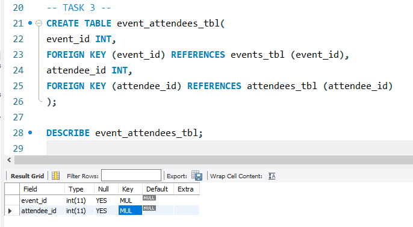
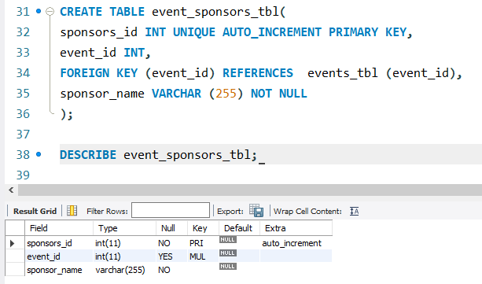
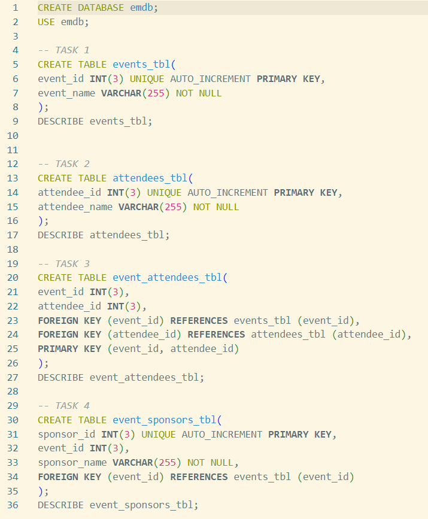
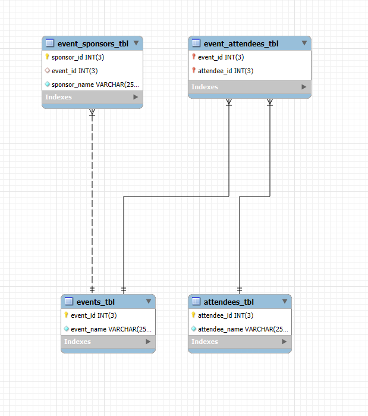

# 💻 *Finals Lab Task 1*

## *Task Description*
Design and implement a MySQL database for an event management system.

## *Step 1*
Create a table named events with the following fields:

- event_id: Unique integer, auto-increment, primary key

- event_name: String (VARCHAR) with up to 255 characters, not null

## *Step 2*
Create a table named attendees with the following fields:

- attendee_id: Unique integer, auto-increment, primary key

- attendee_name: String (VARCHAR) with up to 255 characters, not null

## *Step 3*
Create a table named event_attendees with the following fields:

- event_id: integer, foreign key referencing event_id in events

- attendee_id: integer, foreign key referencing attendee_id in attendees

## *Step 4*
Create a table named event_sponsors with the following fields:

- sponsor_id: Unique integer, auto-increment, primary key

- event_id: integer, foreign key referencing event_id in events

- sponsor_name: String (VARCHAR) with up to 255 characters, not null

# Outputs:
## Query Statements

## ER Diagram

## SQL Coppies: DATAABASE & TABLE STRUCTURES
- [Events Table](https://github.com/ryyyysoul/EDMPortfolio/blob/main/Finals%20Task%201/SQL%20Folder/ryyyysoul_db_events_tbl.sql)
- [Attendees Table](https://github.com/ryyyysoul/EDMPortfolio/blob/main/Finals%20Task%201/SQL%20Folder/ryyyysoul_db_attendees_tbl.sql)
- [Event Attendees Table](https://github.com/ryyyysoul/EDMPortfolio/blob/main/Finals%20Task%201/SQL%20Folder/ryyyysoul_db_events_attendees_tbl.sql)
- [Event Sponsors Table](https://github.com/ryyyysoul/EDMPortfolio/blob/main/Finals%20Task%201/SQL%20Folder/ryyyysoul_db_event_sponsors_tbl.sql)
