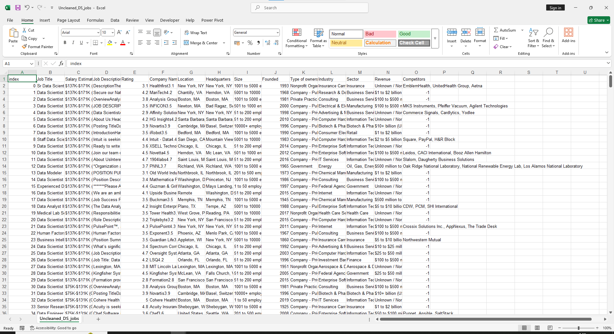
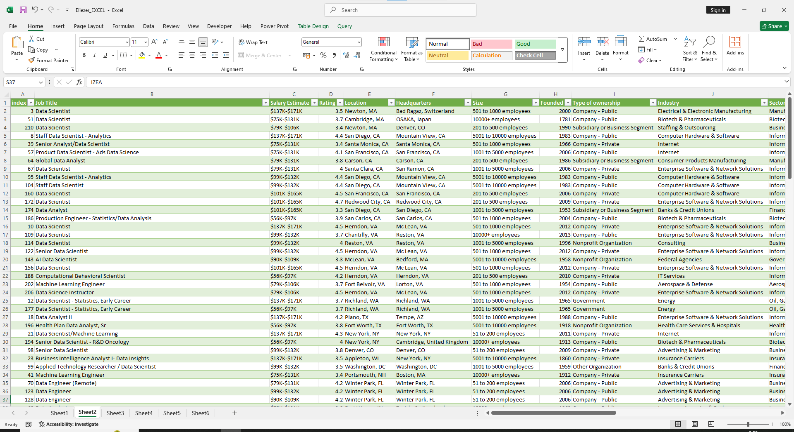
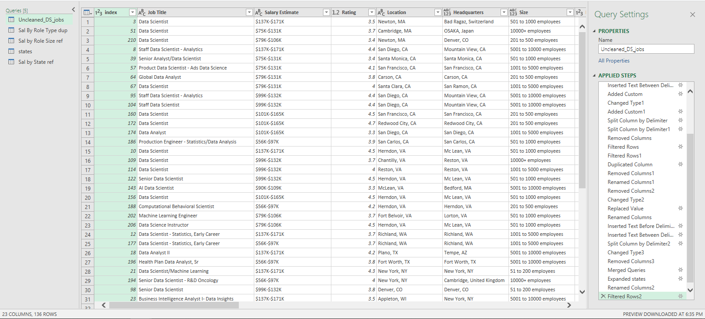
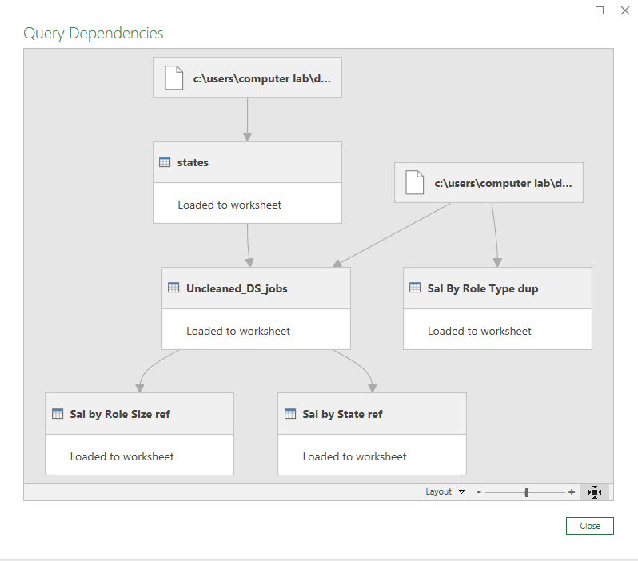

# ***Midterm Lab Task 1 - Data Cleaning and Preparation using Excel***
For this task we are given a Flat data from Excel (See rawfile) and we are Task to perform Data CLeaning and Preparation
## **STEP 1 - Data Cleaning process**
- Load the raw file
- Fit Column and row width and height
- TRIM extra spaces
- Remove NULL values
- Remove Duplicates
## **STEP 2 - Normalization**
- Performed 1NF
- Perform Table split using 2NF
- Perform 3 NF
Mapped the Normalized tables as a Physical Data Model
## **STEP 3 - Here's the screenshot of my output before I started data cleaning (See screenshot)**

## **STEP 4 - Here's the screenshot of my output after I started data cleaning (See screenshot)**

## **In Power Query**

## ***Here's the Physical Data Model***

