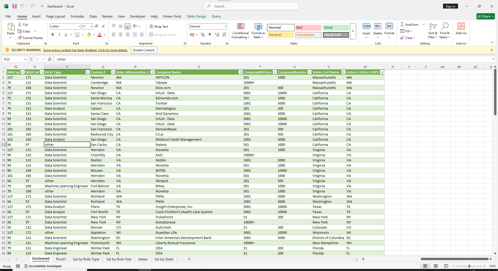
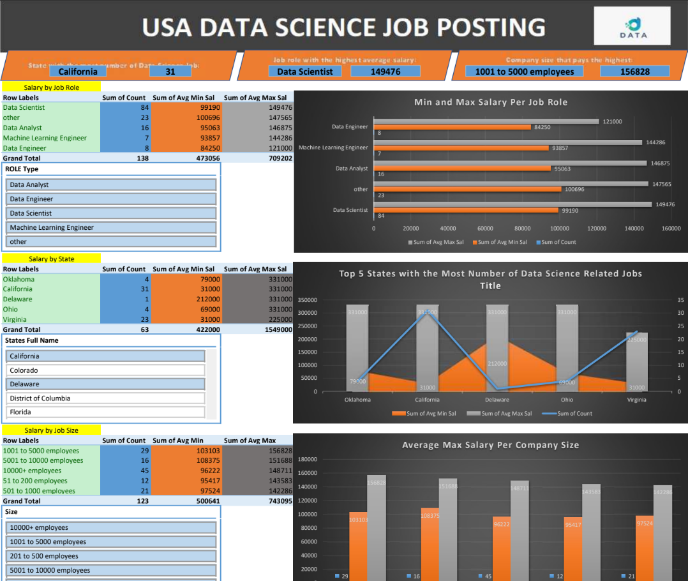
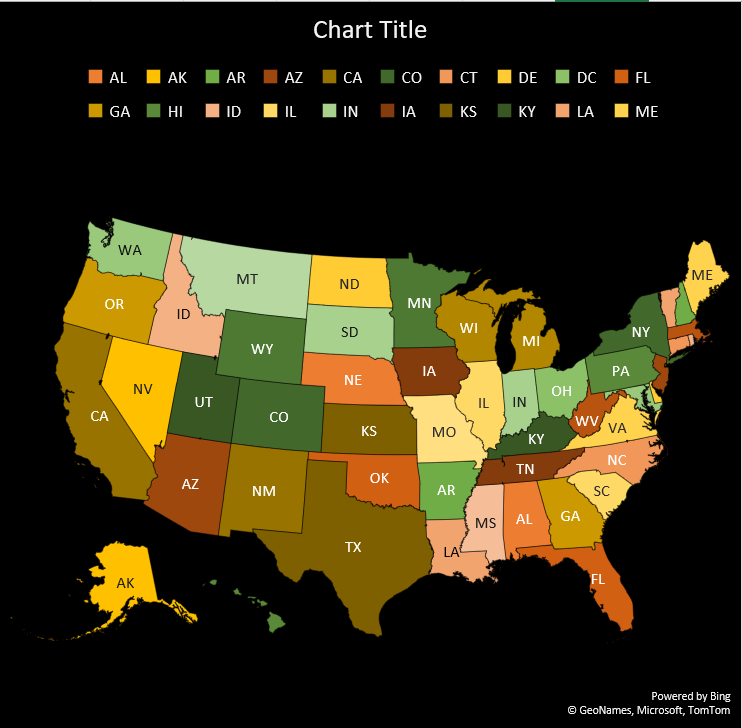
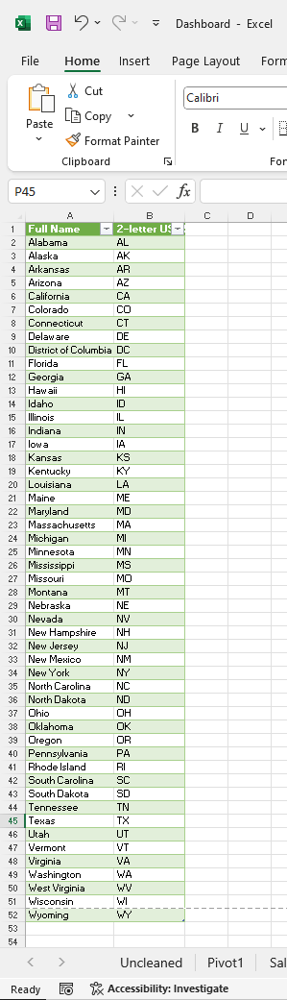

# ***Midterm Lab Task 3 - Creating a PIVOT TABLE and a DASHBOARD***
## For this task we are focusing on building the dashboard with the necessary pivot tables, charts, and interactivity using slicers. I'll break down the steps to ensure clarity:
## **STEP 1 - Data Preparation**
- Load the raw file
- Using the Worksheet on Uncleaned DS Jobs and the transform tables

  A. Sal By Role, Sal By State, Sal by Size
- Design your DASHBOARD that would highlight the ff:

  A. State with the most Number of Data Science

  B. Job Role with the Highest Average Salary

  C. Which Company Size pays the Highest
- Do the necessary Pivot Table, and appropriate charts for the necessary reports
- Insert Slicers for Role Type, Size and State
## **STEP 2 - Pivot Table Adjustments**
- Insert MAP for Dashboard
- Apply a own design and colour settings
- The Slicers should make the Dashboard interactive
Mapped the Normalized tables as a Physical Data Model
## **STEP 3 - Here's the screenshot of my output before I started designing my Dashboard (See screenshot)**

## **STEP 4 - Here's the screenshot of my output after I started designing my Dashboard (See screenshot)**

## **Dashboard Map Chart**

## ***Here's the State Mapping Table***

